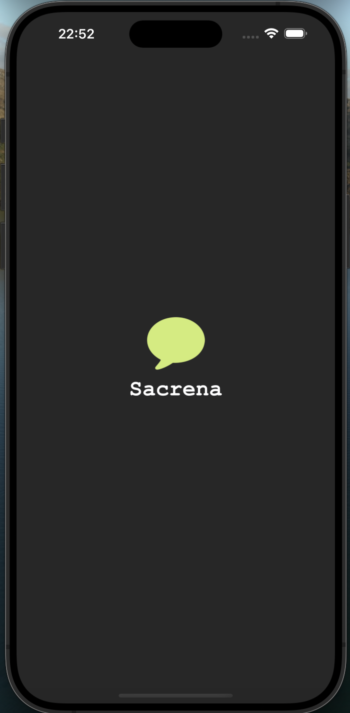
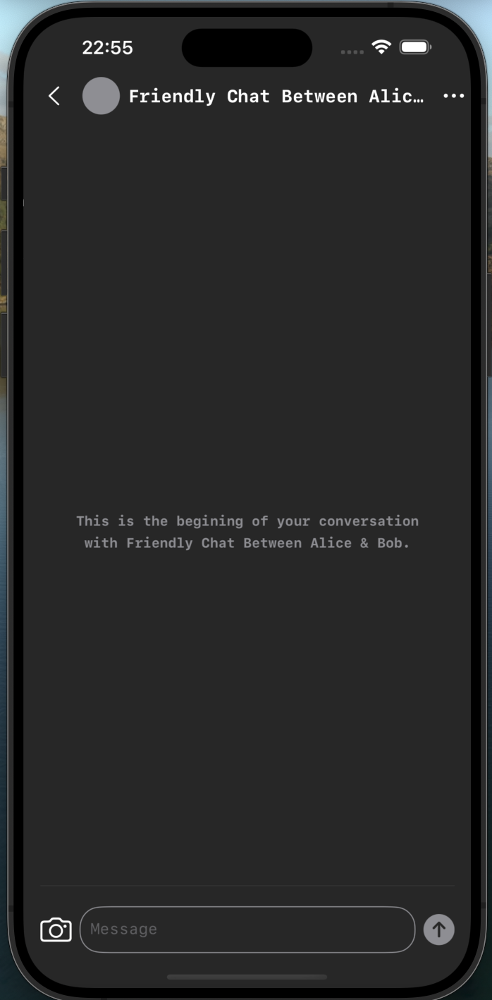
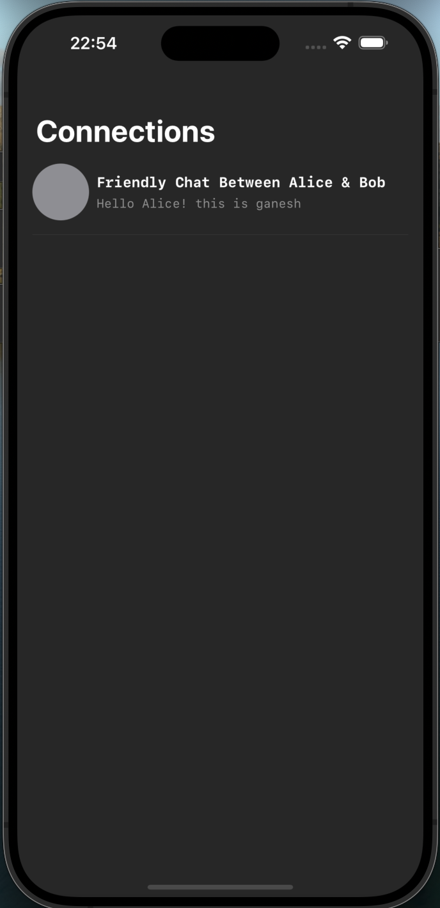
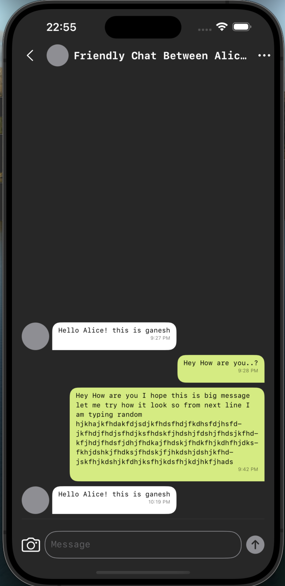
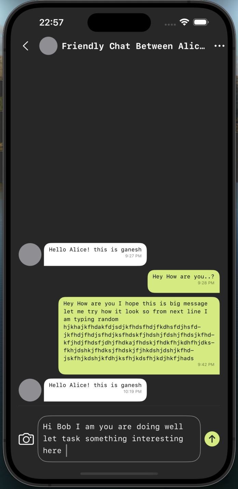
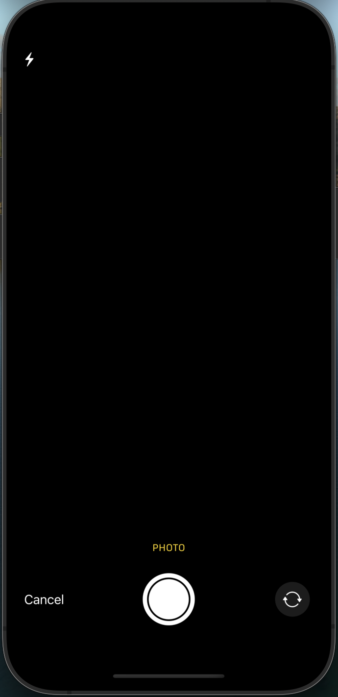

# Sacrena

## App SnapShots

| Launch | ChatListEmpty | ChatList |
| -- | -- | -- |
|  |  |  
| ChatEmpty | Chat | TextField |
| -- | -- | -- |
|  |  | 
| Camera 
| -- |
|   |

## Overview

Alice is using the Sacrena app on her phone, while Bob is using the web version. They’re both enjoying seamless messaging across platforms. Alice sends a message through the app, and Bob, using the web, replies by sending a message through the simple HTML form provided.

## Tech Stack

- Xcode 15.3
- macOS Sonoma 14.5
- iOS 17
- Swift 5.9
- SwiftUI
- GetStream ThirdParty

- ## Features Highlights

### GetStream Integration

- I've integrated GetStream for seamless and reliable real-time chat functionality, ensuring smooth message delivery and an enhanced user experience during conversations.
- [GetStream](https://getstream.io/) offers secure and scalable messaging solutions across platforms, providing efficient data synchronization and low-latency interactions.

### Persistence of Chat Data with GetStream

- All your chat data is seamlessly stored using GetStream, ensuring that your messages are available even when you have no internet connection. This feature allows you to browse your existing chat history without interruption, providing a smooth offline experience.
- [GetStream](https://getstream.io/) ensures reliable message delivery and local caching for better performance across all scenarios.

### Architecture

- Sacrena follows the MVVM (Model-View-ViewModel) architecture, ensuring a clean and maintainable codebase.

### Customizations
  
- Custom NavigationStack: The app features a custom navigation stack for enhanced navigation and user experience.

## Getting Started

To get started with Sacrena, follow these simple steps:

1. Clone the project from the provided GitHub repository.

2. Open the project in Xcode.

3. Build and run the app on your iOS device or simulator.

4. For Bob (using the web version), use the following HTML code to set up chat communication.
5. Open the HTML file in an editor and set the required variables (`apiKey`, `bobUserId`, `userToken`, etc.). You can find the file here: 
<marquee behavior="scroll" direction="left">
<a href="Sacrena/Files/Bob.html">Bob.html</a>.
</marquee>

5. Once everything is set, open the HTML in your browser. As soon as you load it, a message will be sent to Alice. You can check the browser's console logs to verify the message.

## Support and Contact

If you have any questions or need assistance, please contact ganeshrajugalla@gmail.com.

I hope you enjoy using Sacrena and find it a valuable addition to your daily conversations. Happy chatting!

